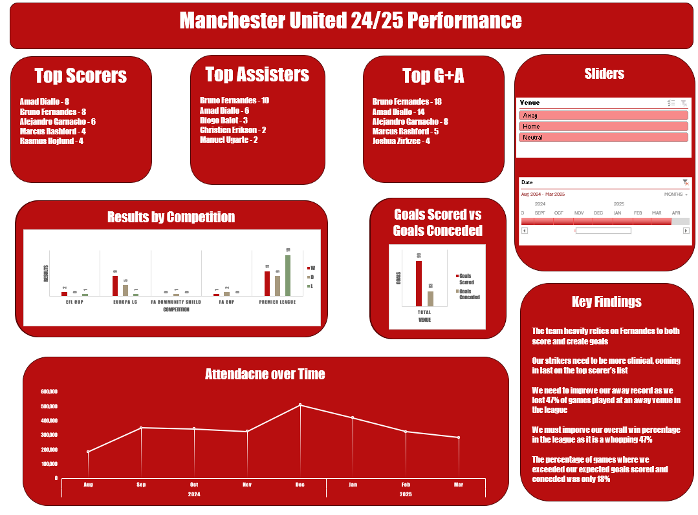

# ⚽ Manchester United 2024/25 Performance Analysis

This project analyzes Manchester United’s 2024/25 season using match and player data scraped from FBref. It highlights key performance metrics, visual trends, and tactical insights using Python and Excel. View dashboard here:

---

## 📌 Project Goals

- Scrape season data from [FBref](https://fbref.com).
- Clean and structure the data using Python (Pandas)
- Analyze team and player-level statistics in Excel.
- Build an interactive dashboard showcasing key performance indicators (KPIs).

---

## 📂 Files Included

| File | Description |
|------|-------------|
| `ManchesterUnitedDashboard.xlsx` | Interactive dashboard and KPI visuals |
| `ManchesterUnitedWebScrape.ipynb` | Notebook |
| `ManchesterUnitedDashboard.png` | Screenshot of excel dashboard |
| `README.md` | Project overview|

---

## 📈 Key Insights

- When it comes to scoring and creating goals, the team heavily relies on Bruno Fernandes as seen by him being among both the top scorers and assist givers in the team. However, Bruno underperformed based on his expected goals and assist for the season which could be a major reason for the team's struggle to get goals.
- Both Rasmus Hojlund and Johsua Zirkzee, the two main strikers in the team, have heavily underperformed as neither were among the top 3 scorers in the team. Even then, no player on the top scoreer list has over 10 goals to their name this season and this shows the deeper issue, our attack has been failing. Furthermore, we scored a total of 99 goals this season which is nearly 100 goals less than League winners Liverpool. My recommendation would be to sign a prem proven striker that can be clinical in the important moments.
- The team as whole only exceeded their expected goals scored and conceeded in 18% of the games this season, many times conceeding more goals than expected. This is a sign that the current position deployed by manager Ruben Amorim is not getting the best out of the squad's current defenders.
- Amad Diallo and Alejandro Garnacho were both among the top performers in the team, based on goals and assist which is evidence to thier importance to the team in these wide positions. A position playing into this strength may imporve results next season.
- Laslty, our away record was abysmal this season, losing 47% or Premier League games played at the opponents stadium and having an away goal difference of 0 with 40 goals scored and 40 goals conceded in all competitions. 

---

## 🚀 Tools Used

- **Python** – Web scraping and data cleaning
- **Excel** – Analysis, pivot tables, KPI dashboard
- **Jupyter Notebook**

---

## 🔮Future Work

- Automate the web scraping using Beautiful Soup and Requests and using a website with live updates for the 2025/26 season
- Compare stats from Ruben Amorim's first full season with past managers to facilitate analysis over multiple years
- Expand the dataset to include deeper individual stats such as pass accuracy, chances created/missed, and more defensive stats
